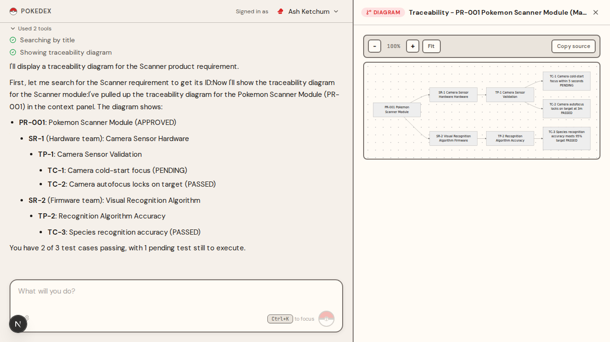

# Pokedex PLM

[](https://pokedex-plm.vercel.app) [](LICENSE) []()

A chat-based Product Lifecycle Management app. Type what you need; the AI proposes the change; you confirm before anything is written.



## Why I built this

I'm a PM who has spent more hours than I'd like clicking through PLM tools. Creating a requirement, approving it, writing a test procedure, recording results - every action means navigating multiple screens, and things fall behind because nobody wants to do it. I wanted to see if a chat interface could carry that whole workflow.

So I built the version of PLM I wished I had. You type "create a requirement for pokemon scanner testing" or "what did Brock work on last week?" and the AI handles the lifecycle command, pulls from the audit log, or renders a traceability diagram in the panel beside the chat. The bet is that chat plus a structured context panel beats click-driven forms for the daily PM workflow.

The trust principle is the one rule I refused to break: **nothing is updated without my confirmation.** Every destructive action the AI proposes (create, cancel, re-parent, reactivate, correct a result) waits for an explicit yes. The goal is to build trust in the model first, then layer in more automation later (auto-parsing test procedures, generating test cases from specs). Without that confirmation gate, chat-driven PLM is a bug factory.

## What it does

- **AI chat with confirm-before-act.** Claude (via Vercel AI SDK v6) drives 45 tools across mutations, queries, and UI intents. Every destructive call requires a `confirmed: true` field, enforced at the schema level - the AI literally cannot bypass it.
- **Interactive context panel.** Detail views (Framed Dex Entry cards, inline editing, lifecycle action buttons), data tables (10 query types with cross-entity columns), Mermaid traceability/status/coverage diagrams, and a filterable audit log - all driven by the AI via UI intent tools.
- **Full lifecycle management.** Draft -> Approved -> Canceled with enforced transitions. Cascade cancel and reactivate. Re-parent sub-requirements and test procedures. Recovery operations for executed test cases (correct wrong result, re-execute failed, update notes). Every transition audited.
- **Audit, traceability, and observability.** Every mutation logged with actor, source (chat vs panel vs api), and change details inside the same Prisma transaction. Database-backed session tracing (`TraceEvent` model, 7 event types) for AI observability, viewable at `/admin/traces`.

## Who this is for

A PM or PMM learning to build AI products and curious how a chat-first surface plays against a structured backend. Engineers evaluating AI orchestration patterns (service-layer tool calls, confirm-before-act, panel-as-tool-output) will find a working reference. Honestly, this is a demo and learning vehicle, not a production product - I built it to learn, the seed data is Pokemon-themed, and the auth is hardcoded.

## Try the demo

Live at [pokedex-plm.vercel.app](https://pokedex-plm.vercel.app). Pick one of the 7 Pokemon demo users from the dropdown, then try:

- "Show me the details for Pokemon Scanner Module"
- "What did Brock work on last week?"
- "Show me a traceability diagram for the Power System requirement"

## What's missing (known limitations)

- **No real authentication** - 7 demo users (Pokemon characters) are hardcoded. You pick a user from a dropdown. Real sign-in with email/password or OAuth is planned.
- **No permissions** - All users see all data and can do everything. Role-based access control (admin, editor, commenter) scoped by team is planned.
- **No file attachments** - The data model supports attachments, but there's no upload UI. We could add support for Z drive links or file uploads - worth discussing.

## Lessons learned (with receipts)

Three lessons worth pulling forward from the build:

- **Two lines of CSS quietly broke every Tailwind spacing utility.** A global reset (`* { margin: 0; padding: 0 }`) was overriding every margin and padding class in the app. Deleting it fixed dozens of layout issues at once. Receipt: [Phase 3 of JOURNEY.md](docs/JOURNEY.md#phase-3-making-it-look-right).
- **Mermaid diagrams went text-blind when sanitized.** DOMPurify was stripping the SVG elements Mermaid uses for labels. The fix was `ADD_TAGS: ["foreignObject", "style"]` so the sanitizer keeps the structural pieces but still strips scripts. Receipt: see the `Security` notes in [CLAUDE.md](CLAUDE.md).
- **Spec first, then design.** The first UI was a slate+teal frosted-glass mess that I kept "tweaking." The redesign that stuck (warm Pokemon Indigo League parchment, solid surfaces, thick borders, "chrome bold, data restrained") came from writing an explicit spec - hex values, fonts, spacing rules - before opening the editor. Receipt: [Phase 3 of JOURNEY.md](docs/JOURNEY.md#phase-3-making-it-look-right).

## How this was built

Six phases (foundation, AI layer, UI design, hardening, lifecycle operations, testing), each shaped by an explicit explore -> plan -> execute -> review discipline using a Claude Code slash command toolkit. Every feature started with `/explore`, got a written plan via `/create-plan`, was built with `/execute`, and reviewed with `/review-*` before merging. The phase-by-phase build story (and the design lessons behind each phase) lives in [JOURNEY.md](docs/JOURNEY.md).

## Design decisions you can poke at

Receipts for the judgment calls behind this app:

- The Pokemon Indigo League design system and rationale: [CLAUDE.md](CLAUDE.md) Design Decisions section.
- Phase-by-phase build story and what each phase taught me: [docs/JOURNEY.md](docs/JOURNEY.md).
- AI product structure (context, orchestration, observability, evals): [docs/AI-PRODUCT-GUIDE.md](docs/AI-PRODUCT-GUIDE.md).
- Roadmap and explicitly-rejected items (no BOM, no ECO, no dashboards): [ROADMAP.md](ROADMAP.md).
- Design HTML prototypes from the redesign phases: [design-concept.html](design-concept.html), [design-concept-phase2.html](design-concept-phase2.html).

## Demo users

The app ships with a Pokedex hardware PLM dataset and 7 demo users. Switch users from the dropdown in the top-right corner.

| User | Team |
|------|------|
| Ash Ketchum | Product |
| Misty Waterflower | Field Testing |
| Brock Harrison | Hardware |
| Gary Oak | Design |
| Professor Oak | Firmware |
| Jessie Rocket | Team Rocket QA |
| James Rocket | Team Rocket QA |

## What's coming

- **User authentication and role-based permissions** - Real sign-in, plus admin/editor/commenter roles scoped by team.
- **Document parsing** - Upload PDFs or Word docs and extract requirements automatically.
- **AI evals and maintenance plan** - Automated quality checks for AI responses, plus a strategy for model upgrades and prompt tuning.
- **Configurable approval chains** - Multi-step, multi-role sign-off workflows (V3).
- **Baseline snapshots and CAPA** - Point-in-time milestone snapshots and a quality management workflow (V3).

Full picture in [ROADMAP.md](ROADMAP.md).

---

## For Developers

### Tech stack

Next.js 16 + TypeScript + Prisma + Neon Postgres + Vercel AI SDK v6 + Anthropic Claude, with Tailwind v4 and Zustand on the front end.

- **Framework**: Next.js 16 (App Router, TypeScript)
- **Database**: Neon PostgreSQL via Prisma ORM
- **AI**: Vercel AI SDK v6 + Anthropic Claude (streaming chat with 45 LLM tools)
- **UI**: Tailwind CSS v4, Zustand, react-markdown, lucide-react, mermaid
- **Validation**: Zod schemas (shared between API routes and LLM tools)
- **Testing**: Vitest (isolated test database)
- **Auth**: Demo users via Edge Middleware (V1)
- **Security**: Rate limiting (chat endpoint, kill switch via env var), session-based demo limit (HMAC-SHA256 signed cookie), security headers, HTML stripping, UUID validation, generic error responses (no DB detail leakage), robots.txt

### Quick start

```bash
# Install dependencies
npm install

# Set up environment
cp .env.local.example .env.local
# Add your Neon DATABASE_URL and ANTHROPIC_API_KEY to .env.local
# Also create .env with just DATABASE_URL (Prisma CLI needs this)
# For tests: create .env.test with DATABASE_URL pointing to a separate test database

# Set up database (uses migration with custom SQL constraints)
npx prisma migrate deploy

# Seed demo data
npx prisma db seed

# Start dev server
npm run dev
```

### API design

The API uses **domain commands** instead of raw CRUD. Each endpoint maps to one business action:

```
POST /api/product-requirements/create
POST /api/product-requirements/:id/approve
POST /api/product-requirements/:id/cancel
GET  /api/product-requirements
GET  /api/product-requirements/:id
```

#### Entity hierarchy

```
ProductRequirement (org-wide)
  -> SubRequirement (team-assigned)
    -> TestProcedure (logical container)
      -> TestProcedureVersion (immutable snapshots, one draft at a time)
        -> TestCase (execution records)
```

### Chat API

```
POST /api/chat   # Streaming natural language interface to manage PLM entities
```

Send `{ messages: [{ role, content }] }` with `x-demo-user-id` header. Returns a Vercel AI SDK stream. The LLM has 45 tools (28 mutation, 5 read, 4 query, 8 UI intent) and confirms before destructive actions.

### Scripts

```bash
npm run dev          # Start dev server
npm run build        # Production build
npm run test         # Run tests (uses .env.test database)
npm run test:watch   # Watch mode
npm run lint         # ESLint
```

### Project structure

```
src/
  app/               # Next.js pages + API routes
    api/             # 47 route handlers (domain commands + queries + chat)
    page.tsx         # Chat UI (dual-panel, streaming)
    globals.css      # Tailwind v4 + design tokens
  components/chat/   # Chat UI components (10 files)
  components/panel/  # Context panel views (detail, table, diagram, audit, error)
  hooks/             # Shared React hooks (useDesktopBreakpoint)
  stores/            # Zustand stores (panel state + width)
  types/             # Shared TypeScript types + Zod schemas (panel payloads)
  lib/ai/            # LLM layer: system prompt, 45 tools, trace logger
  lib/               # Shared utilities (prisma, errors, auth, demo-users)
  schemas/           # Zod validation schemas
  services/          # Business logic with lifecycle enforcement + audit logging
  __tests__/         # Vitest tests (lifecycle, schema, integration, panel)
prisma/
  schema.prisma      # Database schema (10 models, 9 enums)
  seed.ts            # Demo data seeder
docs/
  DATABASE.md        # Schema documentation and seed data
  STATUS-GUIDE.md    # Lifecycle status reference
  USER-GUIDE.md      # End-user guide
  design/            # Design specs and HTML prototype
```

### Documentation

- [docs/JOURNEY.md](docs/JOURNEY.md) - How the project was built, phase by phase
- [docs/AI-PRODUCT-GUIDE.md](docs/AI-PRODUCT-GUIDE.md) - How context engineering, orchestration, observability, and evals fit together
- [docs/USER-GUIDE.md](docs/USER-GUIDE.md) - What the app does, how to use the chat, example prompts
- [ROADMAP.md](ROADMAP.md) - V1 summary, V2/V3 planned features
- [docs/STATUS-GUIDE.md](docs/STATUS-GUIDE.md) - Full lifecycle status reference
- [docs/DATABASE.md](docs/DATABASE.md) - Schema documentation and seed data
- [AGENT-SETUP.md](AGENT-SETUP.md) - Clone-to-dev-server runbook for an AI agent with shell access

---

## Issue Log

18 issues tracked. 15 completed, 3 open. See [GitHub Issues](https://github.com/mayankmankhand/pokedex/issues) for the full list.
